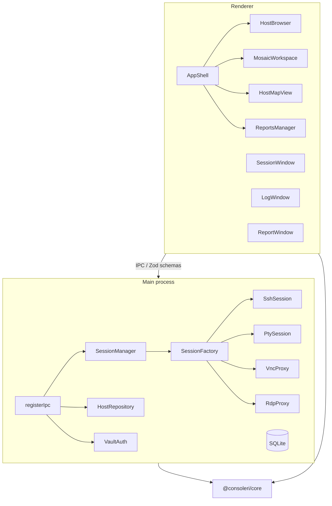

# Agent guide — Consoleri

Consoleri is an Electron desktop app for managing remote hosts: SSH, local shells, RDP, and VNC. The main UI is a mosaic workspace where sessions open as resizable panes, alongside a host browser, an interactive map view, a reports subsystem, and a HashiCorp Vault integration. This document is written for AI agents and contributors working inside the repo.

## Monorepo layout

```
consoleri/
├── apps/desktop/     @consoleri/desktop — Electron + React
├── packages/core/    @consoleri/core — pure functions + Vitest
├── scripts/          dev, pnpm wrapper, postinstall, rebuild-native, release
├── docs/
└── pnpm-workspace.yaml
```

pnpm is bundled in root `devDependencies` (`pnpm@10.12.1`). A global install is not required — use `npm run *` or `node scripts/pnpm.mjs` for everything.

## Commands

| Command | What it does |
|---------|--------------|
| `npm run install:deps` | `pnpm install` via the local wrapper |
| `npm run dev` | full `electron-vite build`, then `dev:watch` |
| `npm run build` | production build for `@consoleri/desktop` |
| `npm run package` | builds Windows distributable |
| `npm run lint` / `typecheck` | linting and TypeScript checks |
| `npm run test` | Vitest for **both** `@consoleri/core` and `@consoleri/desktop` |
| `npm run rebuild-native` | recompile `node-pty` with `@electron/rebuild` |
| `npm run install:electron` | manual fallback if postinstall was skipped |
| `npm run release -- patch` | bump version, update `CHANGELOG.md`, commit and tag |

`npm run dev` always runs a full pre-build first so main/preload/renderer are in sync before the dev server starts.

Hot-reload only (skip pre-build):

```bash
node scripts/pnpm.mjs --filter @consoleri/desktop dev:watch
```

## Architecture overview



### `packages/core` — shared pure logic

All domains are re-exported from `packages/core/src/index.ts`. Grouped by area:

- **workspace/layout** — mosaic tree helpers: `insertPaneIntoLayout`, `removeFromLayout`, `splitPaneInLayout`
- **protocols** — `isTerminalProtocol`, `defaultPortForProtocol`
- **hosts/** — mappers, bundle, relations, tag colors, HTTP endpoint normalization, input normalization, tag suggestions
- **credentials/resolveAuth**, **keys/**, **vault/** — credential refs, SSH directory artifacts, shell escaping
- **shell/** — `resolveLocalShell`, `resolveRemoteShell`, `parseWslList`, `remotePrompt`
- **map/** — graph layout algorithms: Dagre, force, logical clustering (`buildGraph`, `layoutDagre`, `layoutForce`, `layoutLogicalGraph`)
- **reports/** — normalize/format connectivity and inventory results, HTTP status colors
- **ux/** — UX profile types, defaults, validation, `resolve` (sidebar width constants)
- **rdp/** — RDP resolution helpers, RDPDR, network error mapping
- **logging/verbosity** — shared log verbosity constants

### Main process

**Sessions**

| Module | Role |
|--------|------|
| `SessionManager` | async `open` (returns `{ status: 'connecting' }` immediately), reconnect with same id, IPC push to renderer |
| `SessionFactory` | creates transport by protocol |
| `SshSession` | takes resolved profile + credentials, no repository dependency |
| `PtySession` | local PTY sessions |
| `VncProxy`, `rdp/RdpProxy` | VNC and RDP proxies |
| `ConnectionLog` | per-session ring buffer |
| `CredentialResolver` | resolves credentials from vault, local storage, or key files |
| `SshConnectHelper` | SSH connection helpers including jump host logic |

**IPC**

Handlers are split by domain in `apps/desktop/src/main/ipc/` and registered by `register.ts`:

- `registerHostIpc` — hosts, profiles, workspace, import/export
- `registerVaultIpc` — vault auth and settings
- `registerSessionIpc` — session lifecycle, terminal I/O
- `registerKeysIpc` — SSH key management
- `registerUxProfilesIpc` — UX profile CRUD
- `registerPreferencesIpc` — app preferences
- `registerReportIpc` — connectivity and inventory reports

IPC contracts are defined as Zod schemas in `apps/desktop/src/shared/ipcSchemas.ts`.

**Persistence**

SQLite via `node:sqlite` in `main/db/database.ts`. Repositories: `HostRepository`, `ProfileRepository`, `WorkspaceRepository`, `ReportRepository`, `UxProfileRepository`.

**Windows**

The main window plus three detached windows — `LogWindow`, `SessionWindow`, `ReportWindow` — each with its own preload and renderer HTML entry.

### Renderer

**Layout**

`AppShell` is the root layout: `NavRail` on the left, `ResizableSidebar` (drag-resizable panel), and the main content area. Sidebar width is persisted in the active UX profile's `chrome.sidebarWidth` field — **not** `localStorage`.

**Hosts**

`HostBrowser` (scrollable via `min-h-0 flex-1 overflow-y-auto`), `HostListItem` with inline Edit/Delete actions (visible on hover and selected), `HostDetailPanel`, `HostForm`, `ProfileForm`, `PickProfileDialog`, `HostProfilesSection`.

**Workspace**

`MosaicWorkspace` renders the session mosaic. Workspace state is loaded exactly once in `App.tsx`. Panes are inserted via `insertPaneIntoLayout` from core. `sessionMosaicOps.ts` contains the mosaic-aware session state helpers. Each pane toolbar has a **Log** button that opens a `LogWindow`. Failed sessions are never added to the mosaic.

**Other main views**

`HostMapView` / `HostMapCanvas` — interactive graph map of hosts. `ReportsManager` — connectivity and inventory reports. `VaultSettingsPanel` — vault connection and auth. `KeyManager` — SSH key management. `UxProfileManager` — UX profile management.

**UI kit**

`components/ui/` — `Button`, `InlineConfirmButton`, `ConfirmDeleteButton`, `EditDeleteActions`, `Modal`, `DialogHeader`, `DialogFooter`, `LabeledSelect`, `CheckboxPickList`.

**Multi-window renderers**

`renderer/log-window/`, `renderer/session-window/`, `renderer/report-window/` — standalone renderer entries for detached windows.

## Key files

```
packages/core/src/
apps/desktop/
  electron.vite.config.ts
  src/main/
    sessions/{SessionManager,SessionFactory,SshSession,PtySession,ConnectionLog}.ts
    sessions/rdp/RdpProxy.ts
    ipc/register.ts
    ipc/register{Host,Vault,Session,Keys,UxProfiles,Preferences,Report}Ipc.ts
    db/database.ts
    services/CredentialResolver.ts
    windows/{LogWindow,SessionWindow,ReportWindow}.ts
  src/renderer/src/
    App.tsx
    components/{hosts,workspace,map,reports,vault,layout,ui}/
    session/mosaic/sessionMosaicOps.ts
  src/shared/ipcSchemas.ts
scripts/{dev,pnpm,postinstall,rebuild-native}.mjs
```

## Gotchas

1. **`@consoleri/core` must be bundled in main, not externalized.** In `electron.vite.config.ts`:
   - `externalizeDepsPlugin({ exclude: ['@consoleri/core'] })` on the main build
   - alias `@consoleri/core` → `packages/core/src` for both main and renderer
   - Without this you get a runtime `ERR_MODULE_NOT_FOUND` for `./types` (no `.js` extension in ESM imports).

2. **MosaicNode type mismatch** — react-mosaic and core use incompatible generic types. Cast input as `CoreMosaicNode` when calling core helpers; cast the result back to `MosaicNode` for the renderer.

3. **Terminal connect status** — after calling `attachTransport`, always call `updateStatus(id, 'connected')`. Skipping it leaves the pane UI stuck on "Connecting…".

4. **pnpm not on PATH** — always use `npm run *` or `node scripts/pnpm.mjs` rather than calling `pnpm` directly.

5. **Electron binary** — `postinstall.mjs` downloads the Electron binary if absent. If install scripts were skipped with `--ignore-scripts`, run `npm run install:electron` manually.

6. **Native rollup externals** — `node-pty`, `ssh2`, `cpu-features`, and `node:sqlite` are declared external in the main build's rollup config and must not be bundled.

7. **Failed sessions** — `openSession` returns `null` on error; only non-null sessions are inserted into the mosaic.

## Agent constraints

- `.cursor/plans/` — treat as read-only; do not modify plan files
- Do not commit unless explicitly asked by the user
- Do not revert to npm workspaces or restore `package-lock.json`

## Known gaps

- No E2E tests. Desktop has unit tests split across `vitest.config.ts` (renderer) and `vitest.main.config.ts` (main).
- Connecting to a host without a compatible profile silently picks the first available profile (`connectHost.ts`). A clearer in-UI error or profile picker dialog would improve this flow.
